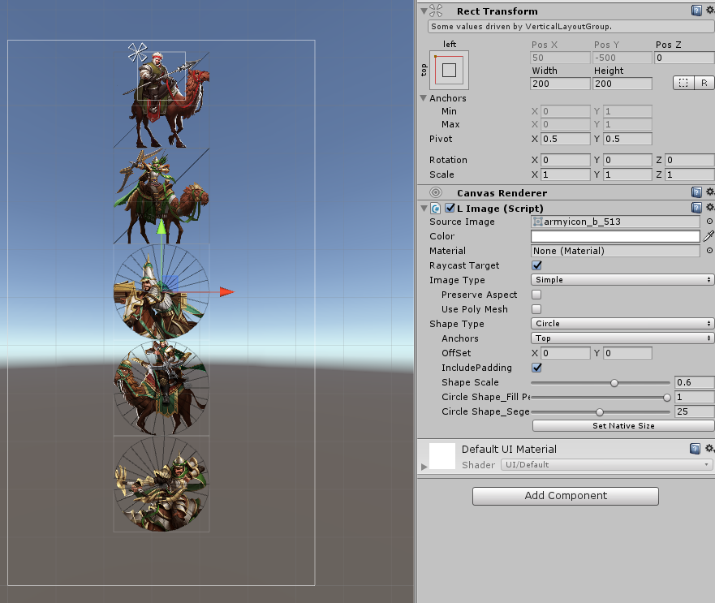
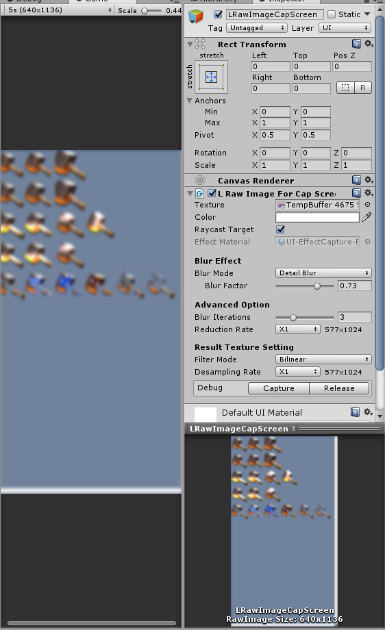
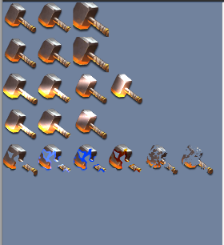

# UGUI_Extension

Unity Version：2017.4.23f1

## 1.Image扩展功能

 相关组件：LImage.cs  

|属性|描述|
--|--|
|Shape Type |裁剪形状(正方形，矩形，圆形)|  
|Anchors | 裁剪锚点，有八个方向|  
|OffSet |UV偏移，用来微调裁剪位置，取值-1到1 |  
|includePadding |计算锚点时，是否包括Padding的值，以保证取到原图大小的中心，但会出现截取到图集其他像素，需要配合ShapeScale使用 |  
|ShapeScale |截取范围的缩放，取值0到1 |  
|CircleShape_Fill_Percent |圆形裁剪时的填充比例，取值0到1 |  
|CirleShape_Segements |圆形裁剪时的面数设置，取值0到50，越小性能越好 | 
|Use Poly Mesh |是否开启多边形绘制模式，目前仅支持Simple和Sliced |  
|Use Poly Raycast Target | 是否开启多边形碰撞检测 |    

## 2.图集管理（使用TexturePacker制作图集）  

相关组件：LImageForTP.cs || AtlasInfo.cs || AtlasManager.cs || AtlasMap.cs  

优点：  
1.TP打图集更加可控，可使用多种不同模式打图集，使图集更加紧凑，多边形网格优化[(参考)](https://www.codeandweb.com/texturepacker/tutorials/using-spritesheets-with-unity)  
2.可手动拆分图集透明通道（支持所有平台）

## 3.RawImage扩展功能（截屏模糊）

相关组件：LRawImageForCapScreen.cs  

描述：便捷的截图模糊功能，多用于弹窗背景。  

## 3.UI特效扩展

相关组件：LUIDissolve.cs || LUIShiny.cs  

描述：实现UI的溶解和流光特效。  

