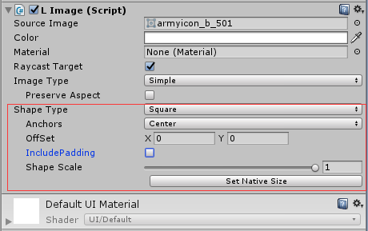
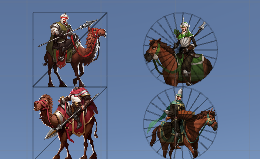

# UGUI_Extension

Unity Version：2017.4.23f1

1.扩展Image，加入了裁剪方形&圆形的功能。
|属性|描述|
--|--|
|Shape Type |裁剪形状|
|Anchors | 裁剪锚点，有八个方向|
|OffSet |UV偏移，用来微调裁剪位置，取值-1到1 |
|includePadding |计算锚点时，是否包括Padding的值，以保证取到原图大小的中心，但会出现截取到图集其他像素，需要配合ShapeScale使用 |
|ShapeScale |截取范围的缩放，取值0到1 |
|CircleShape_Fill_Percent |圆形裁剪时的填充比例，取值0到1 |
|CirleShape_Segements |圆形裁剪时的面数设置，取值0到50，越小性能越好 |
||

